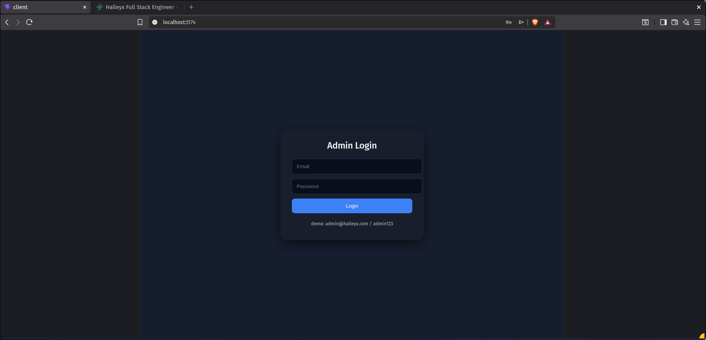
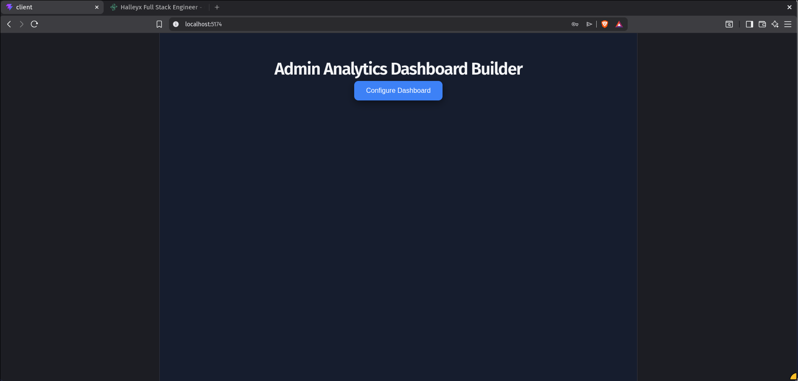
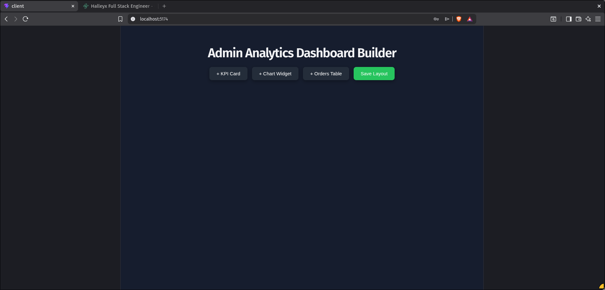
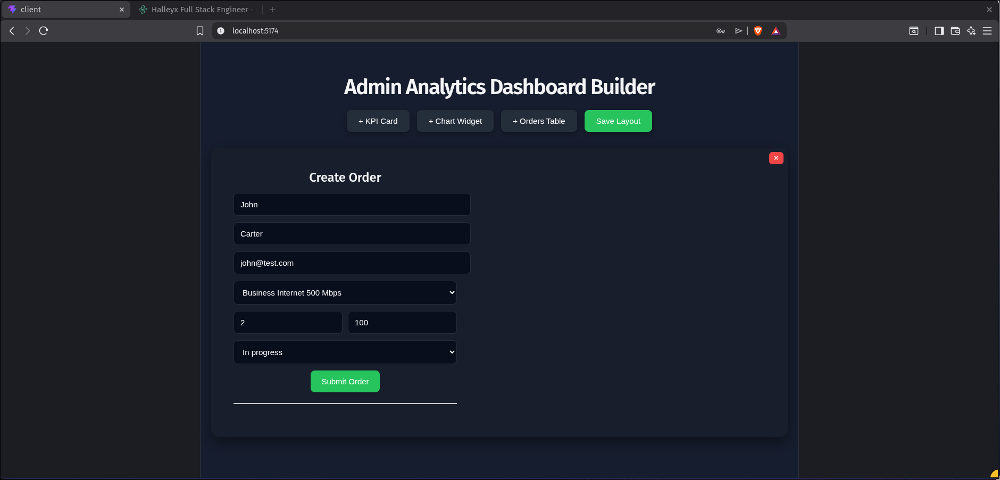
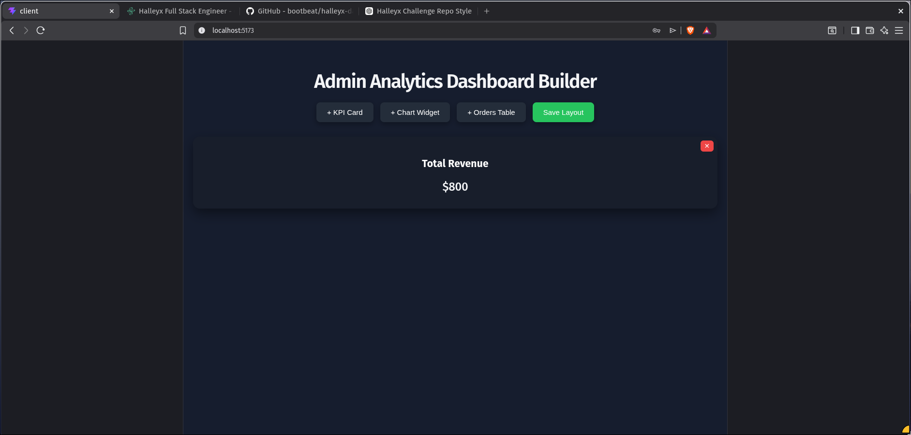
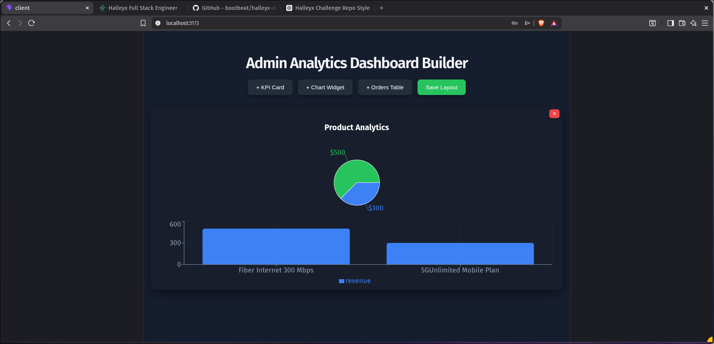
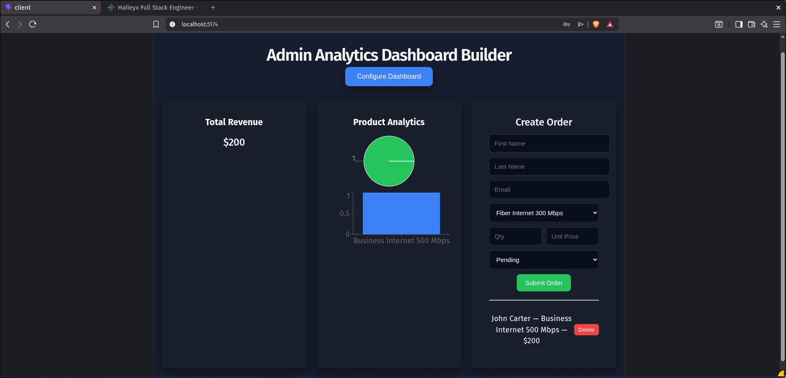

# Halleyx Full Stack Engineer Challenge II  
## Custom Dashboard Builder – Admin Analytics MVP

---

## Overview

This project is a functional MVP implementation of a Custom Dashboard Builder for admin users.  
It enables administrators to dynamically configure analytics dashboards using KPI cards, chart widgets, and customer order tables.

The solution demonstrates full-stack integration, modular UI architecture, responsive layout behaviour, and real-time data aggregation from order data.

---

## Contents

- [Overview](#overview)
- [Features](#features)
- [Tech Stack](#tech-stack)
- [Project Structure](#project-structure)
- [How to Run](#how-to-run-the-project)
- [Screenshots](#screenshots)
- [Notes](#notes)
---

## Features

### Admin Login
- Simple admin authentication screen  
- Demo credentials  
  - Email: admin@halleyx.com  
  - Password: admin123  

### Dashboard Builder
- Default empty dashboard state  
- Configure dashboard mode  
- Dynamically add widgets  
  - KPI Card  
  - Chart Widget  
  - Orders Table  
- Remove widgets  
- Save dashboard layout  

### Customer Order Module
- Create order form with required fields  
  - First Name  
  - Last Name  
  - Email  
  - Product  
  - Quantity  
  - Unit Price  
  - Status  
- Automatic total calculation  
- Delete order functionality  
- Real-time dashboard updates  

### Analytics Widgets

**KPI Widget**
- Displays aggregated total revenue  
- Updates dynamically from order data  

**Chart Widget**
- Pie chart visualization for product distribution  
- Bar chart visualization for order comparison  

### Responsive Layout
- Grid-based widget layout  
- Works across desktop and smaller screen sizes  

---

## Tech Stack

**Frontend**
- React (Vite)  
- Axios  
- Recharts  

**Backend**
- Node.js  
- Express  
- In-memory data storage  

---

## Project Structure

```text
halleyx-dashboard/
│
├── client/
│   ├── src/
│   │   ├── App.jsx
│   │   ├── Dashboard.jsx
│   │   ├── Login.jsx
│   │   ├── Orders.jsx
│   │   ├── KPI.jsx
│   │   └── Chart.jsx
│   │
│   └── package.json
│
├── server/
│   ├── server.js
│   └── package.json
│
└── screenshots/
    ├── login.png
    ├── empty-dashboard.png
    ├── configure-mode.png
    ├── order-form.png
    ├── kpi-widget.png
    ├── chart-widget.png
    └── final-layout.png
```

---

## How to Run the Project

### Start Backend

```text
cd server
node server.js
```

Backend runs at  
http://localhost:5000  

### Start Frontend

```text
cd client
npm install
npm run dev
```

Application runs at  
http://localhost:5173  

---

## Screenshots

### Admin Login  


### Empty Dashboard  


### Configure Mode  


### Customer Order Form  


### KPI Revenue Widget  


### Chart Analytics Widget  


### Final Dashboard Layout  


---

## Notes

This implementation focuses on delivering the core functional aspects of the dashboard builder challenge including widget configuration workflow, analytics visualization, and customer order integration.

Enhancements such as persistent dashboard layout storage, advanced drag-grid snapping, and configurable widget settings panels can be implemented in future iterations.

---

## Author

**Vishnu Prathap**

- GitHub: https://github.com/bootbeat  
- Email:  vishnu17579@gmail.com 
- Role: Full Stack Engineer Candidate  

This project was developed as part of the Halleyx Full Stack Engineer Challenge II submission.

